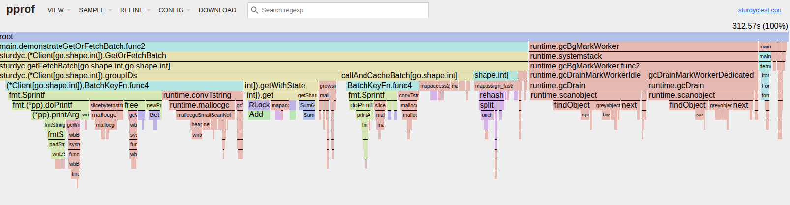

# sturdyctest
a test of sturdy c batch get

this test makes arbitrary number of batches of arbitrary size where the keys are almost completly overlapping

ie this is the perfect stress test for this tool

as currently written it runs with some obvious contention on my box, reducing the batch size by a power of ten seems to work just fine, increasing by a power of ten crashes reliably

this setup outputs a cpu profile for pprof after running:

go tool pprof -http=localhost:8080  cpu.prof 

as we can see from this chart, most of the time goes into grouping the ids from the batches

Given this setup, batches that are large seem to end up consuming all the memory on my box and the process gets killed

in all working cases though, the batch get or fetch reduces the number of outbound calls by roughly 2 orders of magnitude

this is very cool tool

